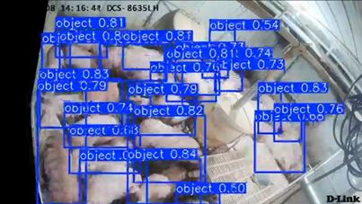

# 電腦視覺專案一：豬隻物件偵測 

本專案為 **TAICA CVPDL 2025 HW-1**  Kaggle 競賽的解決方案。本次專案的目標是訓練一個物件偵測模型，以準確地偵測並定位影像中的**豬隻**。

本專案採用了先進的 **YOLOv10** 架構（透過 `ultralytics` 套件套用），且所有實作與模型訓練皆於 Google Colab 環境上執行。

## 📁 專案結構 (Repository Structure)

```text
.
├── code/
│   ├── src/
│   │   └── code.ipynb        # 包含端到端 (end-to-end) 執行流程的主 Jupyter Notebook
│   ├── README.md             # 原始的中文執行步驟說明
│   └── requirements.txt      # Python 依賴套件清單
├── report.pdf                # 詳細的專案書面報告
├── example.png               # 實際預測效果截圖
└── README.md                 # 本說明文件
```

## 🎬 效果展示 (Demonstration)

這是在測試集上運行我們訓練好的 YOLOv10 模型，偵測影片中豬隻的實際效果截圖與影片展示：



（點擊下方圖片可前往 YouTube 觀看完整影片）：

[](https://www.youtube.com/watch?v=NoLQrFmbwZU)


## 🚀 流程概述 (Pipeline Overview)

本流程 (`code.ipynb`) 專為在 Google Colab 上無縫運行而設計，主要包含以下幾個關鍵階段：

1. **環境設定與資料獲取**
   - 安裝必要的依賴套件（如 `ultralytics` 等）。
   - 透過 Kaggle API 驗證並直接下載競賽資料集。

2. **資料前處理與切分**
   - 解析原始的 Ground Truth (`gt.txt`) 邊界框格式 `[x, y, w, h]`。
   - 將標記轉換為 YOLO 支援的正規化格式 `[class, x_center, y_center, w_norm, h_norm]`。
   - 將資料集切分為 **80% 訓練集 (Training)** 與 **20% 驗證集 (Validation)**。

3. **模型訓練 (Model Training)**
   - **模型架構**：YOLOv10 Large (`yolov10l`)
   - **優化器**：AdamW
   - **超參數**：90 Epochs、Batch Size 16、影像大小 (Image Size) 640
   - **進階訓練技巧**：餘弦退火學習率 (`cos_lr`)、自動混合精度 (`amp`) 以及 Early Stopping (`patience=20`)。

4. **推論與後處理 (Inference & Post-processing)**
   - 載入訓練階段表現最好的權重 (`best.pt`)。
   - 在未看過的測試集 (Test set) 上生成預測結果。
   - 將 YOLO 的正規化預測格式轉換回 Kaggle 提交要求的字串格式 (`conf x_left y_top width height class`)。
   - 輸出最終預測結果至 `submission.csv`。

## 🛠️ 使用方法 (How to Run)

1. 在 **Google Colab** 中開啟 `code/src/code.ipynb`。
2. 掛載您的 Google Drive。
3. 確保您的 `kaggle.json` API 憑證已放置於 `/content/drive/MyDrive/.kaggle` 目錄下，以便順利下載資料集。
4. 依序由上而下執行所有的 Notebook 儲存格。

## 📦 依賴套件 (Dependencies)

本專案所使用的核心套件包含：
- `ultralytics` (YOLO 模型實作)
- `opencv-python` (影像處理)
- `pandas` & `numpy` (資料處理)
- `albumentations` (資料擴增)

完整的套件清單請參閱 `code/requirements.txt`。
